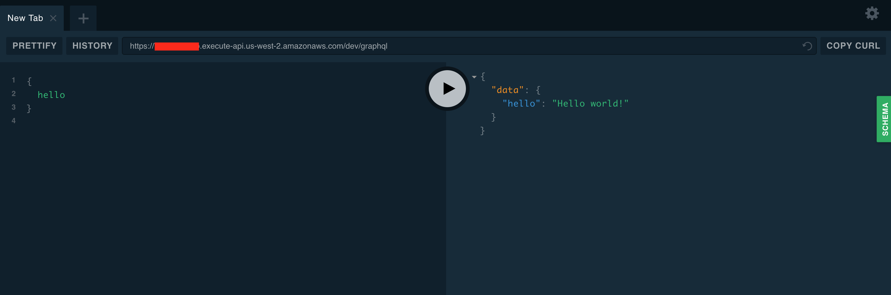
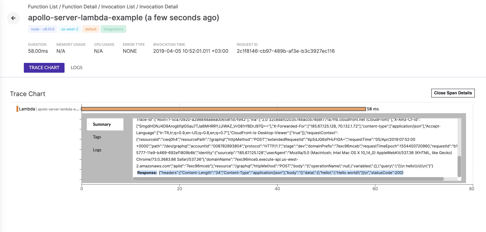

# Hello Thundra
This is a simple project to demo thundra and apollo-server-lambda working together

## How to run using [serverless](https://serverless.com/)

#### 1 - Installation

In `thundra-examples-lambda-nodejs/apollo-server-lambda/` directory:

```bash
npm install
```

#### 2 - Configuration

Open `thundra-examples-lambda-nodejs/apollo-server-lambda/serverless.yml` and set your AWS S3 deployment bucket & api key:

```yml
custom:
    thundraApiKey: <your-api-key>
    deploymentBucket: <your-s3-deployment-bucket>
    ...
```

#### 3 - Deploy

In `thundra-examples-lambda-nodejs/apollo-server-lambda` directory:

```bash
sls deploy
```

#### 4 - Run the graphql query and see the results in Thundra

Copy the API Gateway endpoint in serverless deployment summary and open it in your browser.

Make the query in the apollo console :



See the lambda invocation in Thundra console (https://console.thundra.io)


