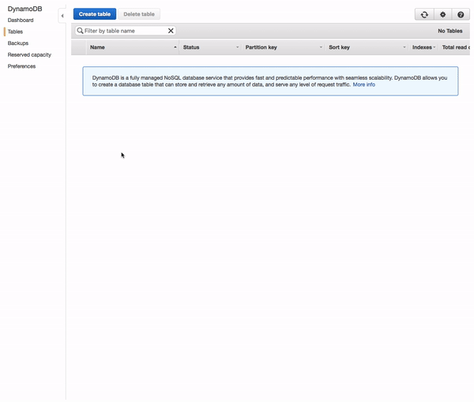

# Thundra Automatic Instrumentation Example

This is a simple example to demonstrate Thundra's tracing capabilities after automatic instrumentation.

If you haven't done already start by installing **serverless** by:
```bash
npm install serverless -g
```

#### 1 - Installation

In `thundra-examples-lambda-nodejs/automatic-instrumentation` directory:

```bash
npm install
```

#### 2 - Create your DynamoDB table
> 2.1 Login to your AWS console and navigate to DynamoDB services and click 'Create table'

> 2.2 Type in your preferred table name in the 'Table name' field, but ensure that you write `hero` in the 'Primary key' field.

> 2.3 Click on the 'Create' button to finish your DynamoDB table creation



#### 3 - Add table name
In `thundra-examples-lambda-nodejs/automatic-instrumentation/services.js` enter your table name in the line below:
```bash
const tableName = '<Enter your DynamoDB table name>';
```

#### 4 - Configuration

Open `thundra-examples-lambda-nodejs/automatic-instrumentation/serverless.yml` and set your AWS S3 deployment bucket & api key:

```yml
custom:
    thundraApiKey: <your-api-key>
    deploymentBucket: <your-s3-deployment-bucket>
    ...
```

#### 5 - Deploy

In `thundra-examples-lambda-nodejs/automatic-instrumentation` directory:

```bash
sls deploy
```

#### 4 - Invoke

In `thundra-examples-lambda-nodejs/automatic-instrumentation` directory:

```bash
sls invoke --function hello-thundra --data '{"hero":"Spiderman"}'
```

#### 5 - Enjoy your flight with Thundra!

Visit Thundra to observe your metrics. It might take 1-2 minutes to be visible.
